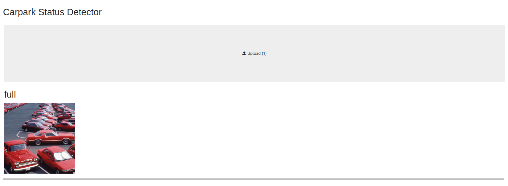

# carpark_image_classifier
Using the Fastai library to build a carpark image classifer and deploy to some applications

## Rationale / Business Case
* This was a chance to use the excellent [fastai library](https://www.fast.ai/) to perform some image classification and use the created model in some applications. 
* I'd heard some data providers were using carpark images to provide retail usage data on supermarkets etc. and thought this was an interesting example.
* Later I discovered the [TFL traffic cam archive](https://www.tfljamcams.net/) and thought it would demonstrate a use of transfer learning (traffic not carparks) and of turning webcam images into actionable data.

## Model Training

## User Interface

## TFL Webcams

