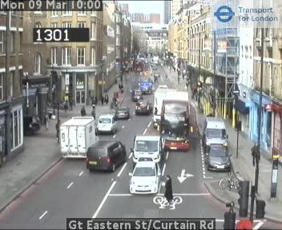

# carpark_image_classifier
Using the Fastai library to build a carpark image classifer and deploy to some applications

## Rationale / Business Case
* This was a chance to use the excellent [fastai library](https://www.fast.ai/) to perform some image classification and use the created model in some applications. 
* I'd heard some data providers were using carpark images to provide retail usage data on supermarkets etc. and thought this was an interesting example.
* Later I discovered the [TFL traffic cam archive](https://www.tfljamcams.net/) and thought it would demonstrate a use of transfer learning (traffic not carparks) and of turning webcam images into actionable data.

## Model Training

I sourced the data from google image search for both categories. Then an initial model run was performed to a generate a first stage classifier that could be used to clean the data set. The fastai widget [Image Cleaner](https://docs.fast.ai/widgets.image_cleaner.html) allows for targetted image dataset tidying and saves lots of manual effort.

Subsequent models were built using the Resnet34 & Resnet50 pre-trained architectures. A model able to classify with 0% error was achieved - though this is likely due to the small dataset of 148 images ( of which 20% were used in validation set).

Interestingly the model was also able to perfrom on generated images of carparks just as well as photos.

Two initial applications for the model were then created: 

## User Interface

Using ipywidgets and the [Voila](https://github.com/voila-dashboards/voila) package, a simple UI image classifer was created. This is an excellent way to demo the model.

## TFL Webcams

Subsequently, whilst looking for a live webcam on which to classify I found the TFL traffic cam archive with pictures every 5 mins for hundreds of London streets. Postulating that static traffic pictures have a lot in common with carpark images, I wrote a notebook to download, classify and, prepare chart data for the traffic images over the course of a day.

The output charts, showing class and probability.

Without the probability line the traffic pattern for this junction is clearer to see.

## Future Developments

The model could do with more training data to perform better against new images. However it would make a good basis for transfer learning and the large amount of image data available from TFL would enable a model to be trained that can provide greater data output for metropolitan streets and potentially show an automated traffic measurement platform.
